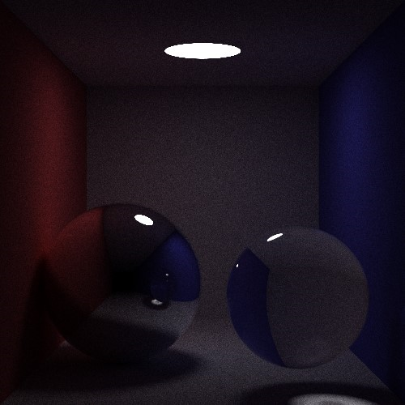
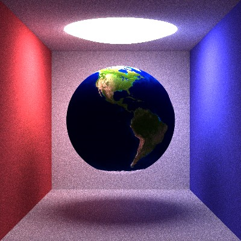

# report for CG大作业
李意菲 2022010725
## 实现功能
路径追踪算法（漫反射with NEE、理想镜面、折射、光滑面）+景深+纹理贴图

### 使用NEE前后的收敛速度和效果对比

采样数：500
渲染时间（cpu）：18.4min

## 原理及效果
### 路径追踪算法+NEE
### 景深
如果相机具有景深效果，则将原先采样时对应的每一条光线进行扰动，形成多条采样光线，将这些采样光线的颜色的平均值作为该点颜色。
具体扰动策略为：保持原光线和新光线在焦平面（与成像面平行，距离视点的距离为焦距）的交点相同，相机视点在以光圈决定的半径范围内随机取点。
焦平面上的颜色几乎不改变，距离焦平面越远，光圈越大，新光线与原光线差别越大，成像也就越模糊。

### 纹理贴图
找到交点后如果该材质为纹理，则计算出纹理图样对应的uv坐标，从实现读取的纹理文件中提取对应位置像素颜色，替代漫反射材质原本颜色进行后续操作。

## 参考代码
1. smallpt
2. 往届学长代码

## 公式使用
1. 折射和光滑面材质的折射项使用了schlick近似
2. 漫反射时考虑直接光源采样，pdf用正对交点光源面积占总表面积的比值近似：